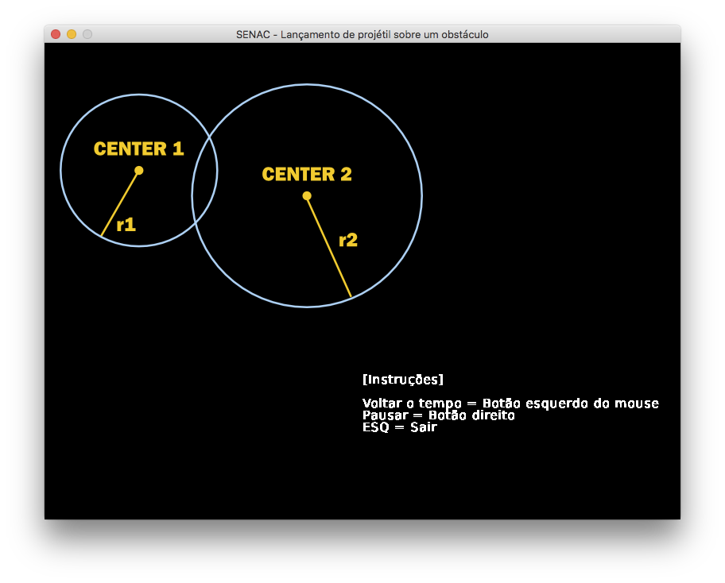

# Simulador de lançamento de projétil

O objetivo deste trabalho é implementar um simulador de lançamento de projétil em Python utilizando a
biblioteca gráfica PyGame. 

O simulador deverá desenhar, em uma janela gráfica, uma parábola que descreve o lançamento de um projétil. 

São informados para o lançamento do projétil um ponto inicial, um
ângulo e uma velocidade, em seguida, o seu simulador verifica se a trajetória do lançamento ultrapassou um
obstáculo e atingiu um determinado alvo. 

Para resolver questões que envolvam as Leis de Newton você
deverá seguir as explicações e definições apresentadas na disciplina de Física para Jogos

[Enunciado](enunciado.pdf) com [Entrada](entrada.txt) e [Saída](saida.txt)

Por fim a [Demonstração](https://youtu.be/R0Iu3LlgiOE)

## Dependencias: 

Python 3 + PyGame 

```
pip install -r requirements.txt
```

Rodar

```
python main.py
```
ou

```
make run
```



[Documentação](doc/pdf/api.pdf)

[Movimento retilíneo uniforme - MRU](https://pt.wikipedia.org/wiki/Movimento_retil%C3%ADneo_uniforme)
